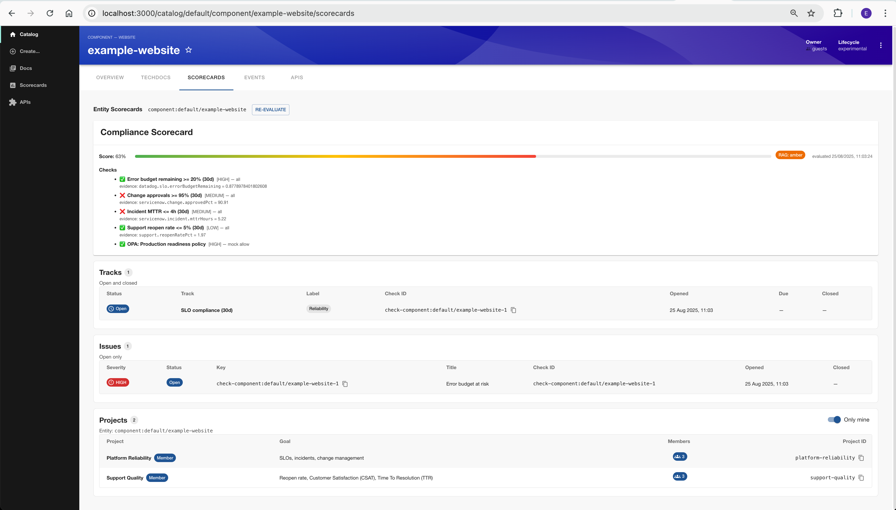
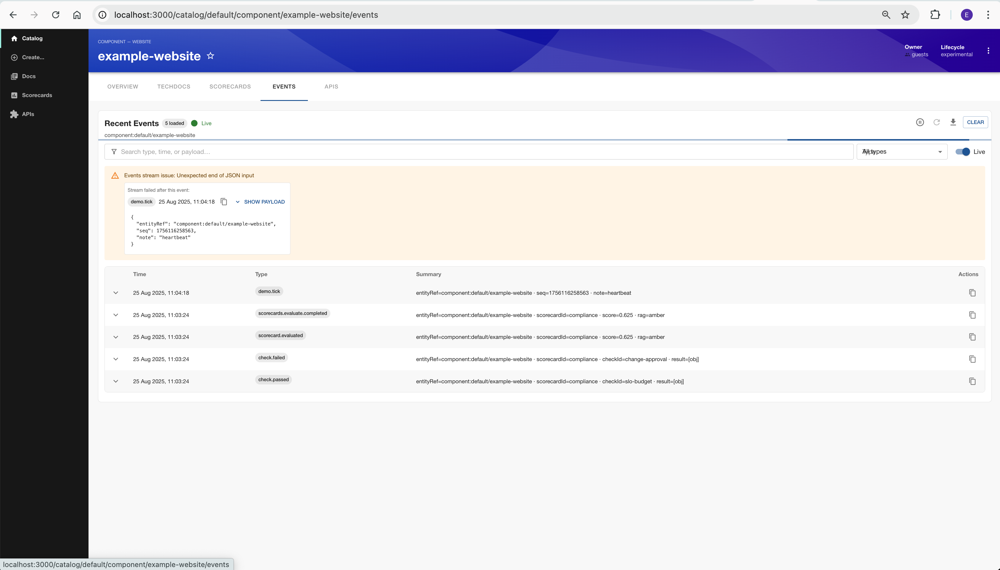

# Scorecards Framework

This repository contains the **Scorecards Framework**, developed to provide a flexible way to build and evaluate scorecards for different systems and use cases.

## ⚠️ Disclaimer
This framework was created with the assistance of **ChatGPT-5** and completed in **under 8 hours**.  
It is provided as-is and should be reviewed and tested before using in production environments.

You can also find the package published at:  
[https://github.com/emmett08/scorecards-framework](https://github.com/emmett08/scorecards-framework)

## Visuals

### Scorecards Overview

### Events Flow

